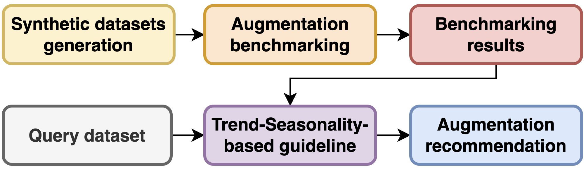
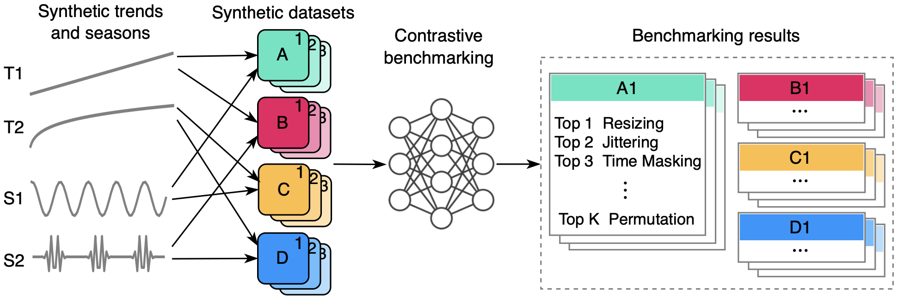
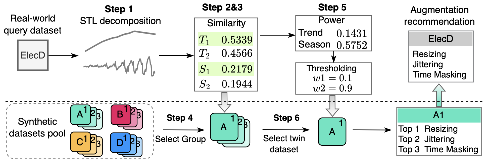

# TS-Contrastive-Augmentation-Recommendation

[](https://badge.fury.io/py/ts-arm)
[](https://opensource.org/licenses/MIT)

**Recommend effective augmentations for self-supervised contrastive learning tailored for your time series dataset.**

Code for paper: [**Guidelines for Augmentation Selection in Contrastive Learning for Time Series Classification**]()

Self-supervised contrastive learning has become a key technique in deep learning, particularly in time series analysis, due to its ability to learn meaningful representations without explicit supervision. Augmentation is a critical component in contrastive learning, where different augmentations can dramatically impact performance, sometimes influencing accuracy by over 30\%. However, the selection of augmentations is predominantly empirical which can be suboptimal, or grid searching that is time-consuming.
In this paper, we establish a principled framework for selecting augmentations based on dataset characteristics such as trend and seasonality. Specifically, we construct 12 synthetic datasets incorporating trend, seasonality, and integration weights. We then evaluate the effectiveness of 8 different augmentations across these synthetic datasets, thereby inducing generalizable associations between time series characteristics and augmentation efficiency. Additionally, we evaluated the induced associations across 6 real-world datasets encompassing domains such as activity recognition, disease diagnosis, traffic monitoring, electricity usage, mechanical fault prognosis, and finance. These real-world datasets are diverse, covering a range from 1 to 12 channels, 2 to 10 classes, sequence lengths of 14 to 1280, and data frequencies from 250 Hz to daily intervals. The experimental results show that our proposed trend-seasonality-based augmentation recommendation algorithm can accurately identify the effective augmentations for a given time series dataset, achieving an average Recall@3 of 0.667, outperforming baselines. Our work provides guidance for studies employing contrastive learning in time series analysis, with wide-ranging applications.

Here is our simplified workflow:
<p align="center"></p>

## Key contributions of this work
- We construct 12 synthetic time series datasets that cover linear and non-linear trends, trigonometric and wavelet-based seasonalities, and three types of weighted integration.
- We assess the effectiveness of 8 commonly used augmentations across all synthetic datasets, thereby elucidating the relationships between time series properties and the effectiveness of specific augmentations.
- We propose a trend-seasonality-based framework that precisely recommends the most suitable augmentations for a given time series dataset. Experimental results demonstrate that our recommendations significantly outperform those based on popularity and random selection.

## Methods
### Generating synthetic datasets and benchmarking the augmentations
<p align="center"></p>

### Tend-Seasonality-Based Recommendation System for Augmentations
<p align="center"></p>

## Recommendation Results
*E.g., Recall@3 = 0.667 = 2/3 means that: 2 out of 3 recommended augmentations fall within the true 3 best augmentations.* 

| Recommendation method |Recall | HAR | PTB | FD | ElecD | SPX500 | Mean |
|:---:|:---:|:---:|:---:|:---:|:---:|:---:|:---:|
| Random | Recall@1 | 0.113 | 0.107 | 0.108 | 0.108 | 0.101 | 0.107 |
|        | Recall@2 | 0.235 | 0.217 | 0.222 | 0.218 | 0.209 | 0.22 |
|        | Recall@3 | 0.335 | 0.331 | 0.336 | 0.339 | 0.331 | 0.334 |
| Popularity | Recall@1 | 1 | 0 | 0 | 0 | 0 | 0.2 |
|            | Recall@2 | 1 | 0 | 0 | 0.5 | 0 | 0.3 |
|            | Recall@3 | 0.667 | 0.333 | 0.667 | 0.667 | 0.667 | 0.6 |
| <mark>Tend-Seasonality-Based (Ours)<mark> | Recall@1 | 1 | 0 | 1 | 1 | 0 | 0.6 |
|                               | Recall@2 | 1 | 0 | 1 | 1 | 0.5 | 0.7 |
|                               | Recall@3 | 0.667 | 0.667 | 1 | 0.667 | 0.667 | 0.734 |


## Installation
To install the **TS** Contrastive **A**ugmentation **R**ecommendation **M**ethod (TS_ARM) tool: 

```bash
pip install ts_arm
```

The TS_ARM tool is lightweight and has minimal dependency on external packages:
```
numpy, scikit_learn, scipy, statsmodels, tqdm
```

## Usage


## Future work
We have several exciting plans for the future development of this project, including but not limited to:
- More patterns of trends and seasonalities.
- More contrastive models.
- Alternative similarity metrics.
- Divergence score thresholding.
- More results analysis.

## License

The TS-Contrastive-Augmentation-Recommendation project is licensed under the MIT License - see the [LICENSE](LICENSE) file for details.


<!--- https://pypi.org/project/ts-arm/0.0.1/ --->
